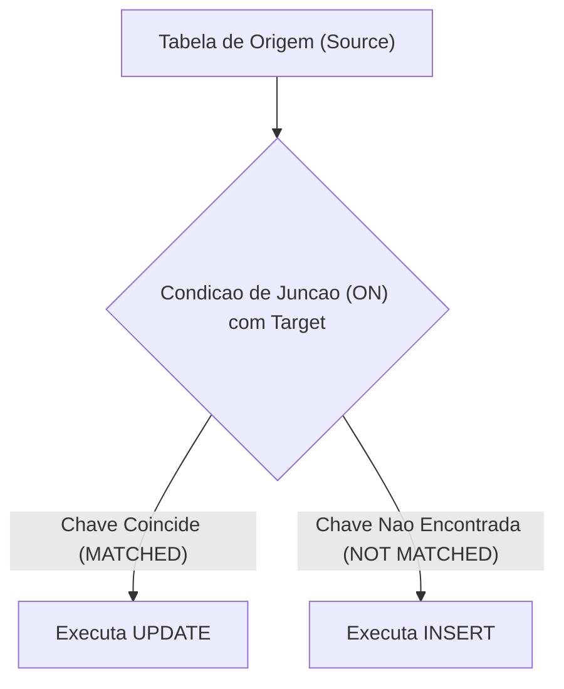

# Data Manipulation Language - DML
## ↩ Voltar [[_SQL_|SQL]]

Tags: #Database #SQL #DML

---
# Indice
- [Visao Geral](#visao-geral)
- [Conteudo Abordado](#conteudo-abordado)
- [Comando INSERT](#comando-insert)
- [Comando DELETE](#comando-delete)
- [Comando UPDATE](#comando-update)
- [Comando MERGE (UPSERT)](#comando-merge-upsert)
- [Boas Praticas e Observacoes](#boas-praticas-e-observacoes)
- [Conteudo Relacionado](#conteudo-relacionado)

---
# Visao Geral
> A Data Manipulation Language (DML) e o subconjunto da linguagem SQL dedicado a persistencia, modificacao, remocao e sincronizacao dos dados contidos nas tabelas. Seus comandos fundamentais sao `INSERT`, `UPDATE`, `DELETE` e `MERGE`, operando sob o controle transacional do banco de dados (ACID).

---
# Comando INSERT

O comando `INSERT` e responsavel por persistir novas linhas na tabela. Os valores enviados sao validados em tempo de execucao contra os datatypes e todas as constraints ativas (`NOT NULL`, `CHECK`, `UNIQUE`, `FOREIGN KEY`).

### Sintaxe Padrao e Boas Praticas
Podemos executar insercoes especificando explicitamente as colunas ou seguindo a ordem fisica da tabela:

```sql
-- Informando as colunas de forma especifica (recomendado)
INSERT INTO tbl_clientes (cliente_id, situacao_id, nome) 
VALUES (2, 'ATV', 'Maria');

-- Omitindo os campos (exige valores para todas as colunas na ordem exata de criacao)
INSERT INTO tbl_clientes 
VALUES (1, 'ATV', 'Chico', 100);

-- Sintaxe generica de referencia
INSERT INTO nome_da_tabela (coluna1, coluna2, coluna3, colunaN)
VALUES (valor1, valor2, valor3, valorN);
```

> **Regras Fundamentais de Insercao**:
> - Campos obrigatorios (`NOT NULL` sem `DEFAULT`) devem obrigatoriamente figurar no comando.
> - A ordem e quantidade dos valores dentro da clausula `VALUES` devem corresponder rigorosamente a ordem das colunas declaradas no inicio.
> - Valores do tipo texto (`CHAR`, `VARCHAR`, `TEXT`) devem ser delimitados por aspas simples (`'texto'`).
> - Valores numericos fracionarios (`DECIMAL`, `NUMERIC`, `FLOAT`) devem utilizar ponto (`.`) como separador decimal.

---
### Insercao Multipla (Batch / Bulk Insert)
Permite persistir multiplos registros aproveitando uma unica transacao de rede e disco.

```sql
-- Padrao Oracle (INSERT ALL)
INSERT ALL
    INTO nome_da_tabela (coluna1, coluna2) VALUES (valor1, valor2)
    INTO nome_da_tabela (coluna1, coluna2) VALUES (valor1, valor2)
SELECT 1 FROM DUAL;

-- Padrao ANSI / PostgreSQL / MySQL / SQL Server
INSERT INTO nome_da_tabela (coluna1, coluna2, coluna3)
VALUES 
    (valor1_1, valor2_1, valor3_1),
    (valor1_2, valor2_2, valor3_2),
    (valor1_N, valor2_N, valor3_N);
```
> O motor transacional garante a atomicidade: a gravacao somente sera concluida se **todos** os registros estiverem estruturados corretamente.

---
### Insercao a Partir de Consultas (INSERT INTO ... SELECT)
Permite migrar e popular tabelas a partir de dados de outras fontes ou da propria tabela:

```sql
-- Padrao Geral ANSI
INSERT INTO tbl_clientes (cliente_id, situacao_id, nome)
SELECT client_id, situacao_id, nome 
FROM tbl_prospects;

-- Sintaxe especifica Oracle com calculo na projecao
INSERT ALL 
    INTO usuarios (id, nome) VALUES (id + 10, nome)
SELECT id, nome FROM usuarios;
```
> - O retorno do `SELECT` deve fornecer a mesma quantidade e compatibilidade de tipos (`DATATYPE`) das colunas de destino.
> - O `SELECT` pode ser originado de uma tabela simples, visoes ou juncoes relacionais complexas.

---
### Tratamento de NULL e DEFAULT no INSERT
Podemos deixar campos assumirem valores nulos ou padroes de duas formas:
1. Omitindo o campo da lista de colunas do `INSERT`.
2. Declarando expressamente as palavras-chave `NULL` ou `DEFAULT`.

```sql
-- Atribuindo valor padrao via palavra reservada DEFAULT
INSERT INTO log_acessos (id_usuario, data_log) 
VALUES (10, DEFAULT);

-- Atribuindo explicitamente DEFAULT e NULL
INSERT INTO log_acessos (id_usuario, data_log, id_modulo) 
VALUES (10, DEFAULT, NULL);
```

---
# Comando DELETE

O comando `DELETE` realiza a exclusao fisica de uma ou mais tuplas da tabela com base em um predicado logico.

### Sintaxe Padrao e a Importancia do WHERE
```sql
DELETE FROM nome_da_tabela WHERE condicao_para_exclusao;
```

> [!CAUTION] Perigo de Perda de Dados
> Caso a clausula `WHERE` seja omitida, **todos os registros da tabela serao excluidos permanentemente**. Se a intencao for esvaziar a tabela por completo sem necessidade de rollback linha a linha, o comando DDL `TRUNCATE TABLE` deve ser priorizado.

Exemplos basicos de remocao:
```sql
-- CUIDADO: Deleta todos os dados da tabela
DELETE FROM tbl_produtos;

-- Exclusao com filtro numerico simples
DELETE FROM tbl_clientes WHERE idade < 15;

-- Exclusao com filtro composto (AND)
DELETE FROM tbl_clientes WHERE idade < 15 AND genero = 'masculino';

-- Exclusao por valor exato de string
DELETE FROM tbl_clientes WHERE cidade = 'Sao Paulo';
```

---
### Filtros Booleans, Nulos e Clausula NOT
```sql
-- Filtro por campo booleano
DELETE FROM tbl_clientes WHERE is_active = true;
-- ou de forma direta
DELETE FROM tbl_clientes WHERE is_active;

-- Negacao logica com NOT
DELETE FROM tbl_clientes WHERE is_active = false;
-- ou
DELETE FROM tbl_clientes WHERE NOT is_active;

-- Exclusao de nulos ou nao nulos
DELETE FROM tbl_clientes WHERE is_active IS NULL;
DELETE FROM tbl_clientes WHERE is_active IS NOT NULL;
```

---
### Exclusao Baseada em Outra Tabela
Quando a remocao depende de condicoes satisfeitas em uma entidade relacionada:

```sql
-- Sintaxe com FROM / JOIN (PostgreSQL, SQL Server)
DELETE FROM tbl_historico
FROM tbl_apagar_registros
WHERE tbl_historico.id_cliente = tbl_apagar_registros.id_cliente
  AND tbl_apagar_registros.autorizado = true;
```

---
### Clausula RETURNING
Permite recuperar informacoes das linhas que acabaram de ser apagadas sem necessidade de uma consulta extra:

```sql
-- Retorna apenas a coluna identificadora dos registros deletados
DELETE FROM tbl_clientes 
WHERE idade < 15 
RETURNING id_cliente;

-- Retorna todos os atributos das linhas excluidas
DELETE FROM tbl_clientes 
WHERE idade < 15 
RETURNING *;
```

---
### Controle Transacional de Exclusao (COMMIT e ROLLBACK)
Como boa pratica operacional em ambientes de producao, consultas previas e blocos transacionais manuais evitam incidentes:

```sql
-- 1. Inspecione primeiro com SELECT os registros que atendem a condicao
SELECT id, nome FROM tbl_clientes WHERE situacao <> 'ativo';

-- 2. Inicia explicitamente uma transacao de escrita
SET TRANSACTION READ WRITE;

-- 3. Executa o comando destrutivo DELETE
DELETE FROM tbl_clientes WHERE situacao <> 'ativo';

-- 4. Se a contagem de linhas afetadas coincidir com a consulta previa:
COMMIT;

-- 5. Se o resultado for divergente do esperado, desfaz a operacao:
ROLLBACK;
```

---
# Comando UPDATE

O comando `UPDATE` modifica valores existentes de colunas ja persistidas. Internamente, os SGBDs gerenciam versoes do registro atraves de controle de concorrencia multiversao (MVCC) ou blocos de log de rollback/undo.

### Sintaxe e Atualizacao de Registros
A omissao da clausula `WHERE` provocara a atualizacao indiscriminada de todas as linhas da tabela.

```sql
-- Atualizacao global (todos os registros sofrem reajuste salarial de 10%)
UPDATE tbl_funcionarios SET salario = salario * 1.1;

-- Atualizacao com condicao de filtro para normalizacao de maiusculas
UPDATE tbl_funcionarios 
SET nome = UPPER(nome) 
WHERE nome <> UPPER(nome);

-- Atualizacao de multiplos atributos em um registro especifico
UPDATE tbl_funcionarios
SET situacao = 'demitido', data_demissao = current_date
WHERE id = 5;
```

---
### Calculos e Manipulacao de Datas
```sql
-- Adiciona 15 dias a data corrente
UPDATE tbl_receber 
SET dt_vencimento = current_date + 15 
WHERE id_receber = 5555;

-- Atribuicao de data literal com conversao explicita de tipo (CAST)
UPDATE tbl_receber 
SET dt_vencimento = CAST('2023-09-30' AS DATE) 
WHERE id_receber = 5555;
```

---
### Atualizacao Relacional (EXISTS e JOIN)

No **Oracle Database**, a clausula `FROM` nao e permitida diretamente no comando `UPDATE`. Para correlacionar com outras tabelas, utiliza-se a clausula condicional `EXISTS`:

```sql
-- Padrao Oracle com EXISTS
UPDATE turmas t
SET t.aviso = 'S'
WHERE EXISTS (
    SELECT 1
    FROM comunicados c
    WHERE c.turma_id = t.turma_id
);

-- Padrao PostgreSQL / ANSI com clausula FROM
UPDATE tbl_clientes
SET situacao = '+7 dias em aberto'
FROM tbl_receber
WHERE tbl_receber.data_vencimento < current_date - 7
  AND tbl_receber.data_baixa IS NULL
  AND tbl_receber.id = tbl_clientes.id_cliente
  AND tbl_clientes.situacao <> '+7 dias em aberto';
```

---
### Atualizacao Baseada em Sub-selects
Sub-selects na clausula `SET` ou `WHERE` permitem atualizar registros dinamicamente sem valores estáticos fixos:

```sql
-- Atualizando status via subconsulta com agregacao e agrupamento no WHERE
UPDATE tbl_clientes
SET situacao = '+7 dias em aberto'
WHERE id IN (
    SELECT id_cliente
    FROM tbl_receber
    WHERE data_vencimento < current_date - 7
      AND data_baixa IS NULL
    GROUP BY id_cliente
);

-- Exemplo Avancado Oracle: Atualizacao simultanea de tupla de campos baseada em subquery
UPDATE employees a 
SET department_id = (
    SELECT department_id FROM departments WHERE location_id = '2100'
),
(salary, commission_pct) = (
    SELECT 1.1 * AVG(salary), 1.5 * AVG(commission_pct)
    FROM employees b
    WHERE a.department_id = b.department_id
)
WHERE department_id IN (
    SELECT department_id FROM departments WHERE location_id = 2900 OR location_id = 2700
);

-- Exemplo PostgreSQL: Atualizacao correlacionada de tupla de colunas
UPDATE accounts 
SET (contact_first_name, contact_last_name) = (
    SELECT first_name, last_name
    FROM employees
    WHERE employees.id = accounts.sales_person
);
```

---
# Comando MERGE (UPSERT)

Em rotinas de integracao de dados, frequentemente e necessario realizar uma operacao de *Upsert* (inserir caso nao exista, atualizar se ja existir, ou excluir sob condicao). No padrao SQL ANSI, essa funcionalidade e unificada no comando `MERGE`.

### Conceito e Vantagens Transacionais
- **Alta Performance**: Processa lote inteiro sob uma unica transacao e varredura de disco.
- **Atomicidade**: Evita corridas de concorrencia (*race conditions*) que ocorrem ao checar com `SELECT` antes do `INSERT`/`UPDATE`.
- **Reutilizacao de Codigo**: Centraliza regras de sincronizacao entre fonte (*source*) e destino (*target*).

---
### Mecanica MATCHED e NOT MATCHED



Analise conceitual de sincronizacao de vendas:
- **Origem (Source)** contem `id_produto` e `qtde_vendas`.
- **Destino (Target)** armazena registros acumulados.
- Se o produto ja existe no destino (`MATCHED`): Atualiza quantidade vendida e data de atualizacao.
- Se o produto nao existe no destino (`NOT MATCHED`): Insere um novo registro com o `id_produto` e a nova quantidade.

---
### Sintaxe Pratica do MERGE
Exemplo completo no dialeto Oracle Database:

```sql
MERGE INTO destino target
USING origem source -- pode ser uma tabela, view ou sub-select
ON (target.id_produto = source.id_produto)
WHEN MATCHED THEN
    -- Acao executada quando o registro ja existe no destino
    UPDATE SET 
        target.qtde_vendas = source.qtde_vendas, 
        target.dt_update = CURRENT_TIMESTAMP
WHEN NOT MATCHED THEN
    -- Acao executada quando o registro e novo
    INSERT (id_produto, qtde_vendas) 
    VALUES (source.id_produto, source.qtde_vendas);
```

> **Nota sobre MySQL e MariaDB**:
> O MySQL e MariaDB utilizam tradicionalmente a clausula proprietaria `INSERT ... ON DUPLICATE KEY UPDATE` para alcancar comportamento similar ao `MERGE`.

---
### Cenarios Comuns de Aplicacao
- Cargas de integracao e sincronizacao de *Data Warehouses* e *Data Lakes*.
- Atualizacao de saldo de estoque no momento da finalizacao de pedidos de venda.
- Recalculo e fechamento mensal de vendas agregadas.
- Atualizacao da lista de clientes com pendencias financeiras em aberto.

---
# Boas Praticas e Observacoes
- **Transacionalidade Rigorosa**: Ao rodar `UPDATE` ou `DELETE` manuais em banco corporativo, sempre envolva a operacao em transacao com verificacao previa via `SELECT`.
- **Preferir Especificar Colunas no INSERT**: Jamais utilize `INSERT INTO tabela VALUES (...)` sem citar os nomes das colunas no codigo-fonte da aplicacao. Caso uma nova coluna seja adicionada futuramente via DDL, o script legado quebrara.
- **Uso do MERGE para Cargas Concorrentes**: O `MERGE` evita problemas de corrida em operacoes de sincronizacao concorrente entre microservicos.

---
# Conteudo Relacionado
- [[_SQL_|Hub SQL]]
- [[DDL|Data Definition Language - DDL]]
- [[DQL|Data Query Language - DQL]]
